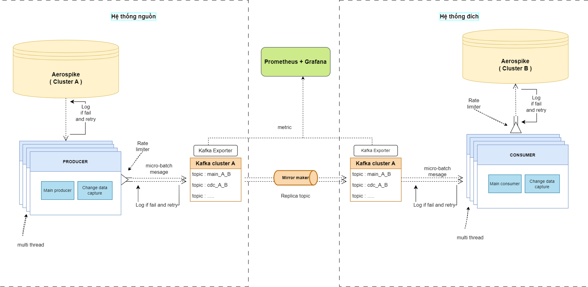
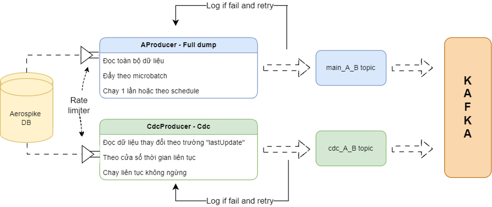
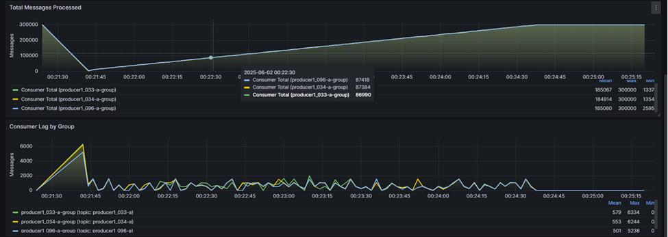
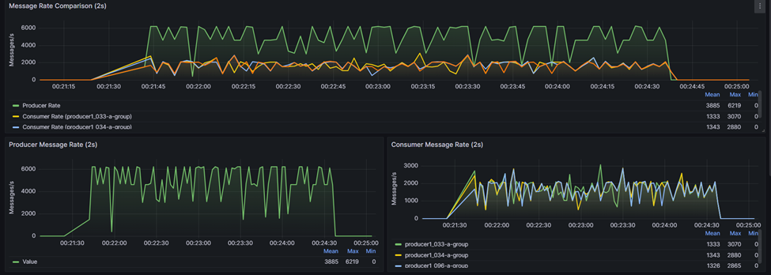

# 🚀 VHT--demo: Hệ thống Streaming dữ liệu giữa các Datastore

> 📡 **Xây dựng giải pháp đồng bộ, ánh xạ và xử lý sự kiện dữ liệu thời gian thực giữa các hệ thống khác nhau (Database, Data Lake), hướng tới ứng dụng trong lĩnh vực Viễn thông.**

---

## 🎯 Mục Tiêu Dự Án

Hệ thống này được thiết kế để:

- 🧠 **Đồng bộ dữ liệu giữa các hệ thống không đồng nhất** (SQL/NoSQL, on-prem/cloud).
- 💾 **Dự phòng dữ liệu** nhằm đảm bảo tính toàn vẹn, sẵn sàng khi có lỗi hệ thống.
- 🔄 **Migrate/Mirror dữ liệu** giữa các cluster/datastore khác nhau mà không gây gián đoạn dịch vụ.
- ⚡ **Xử lý sự kiện thời gian thực** từ các hệ thống khác nhau.
- ⚖️ **Load balancing** và hoạt động theo mô hình **active-active** với TPS control.
- ♻️ **Back-pressure control** để xử lý chậm trễ từ phía đích.
- 🔁 Cơ chế **retry thông minh** với delay và log lỗi.

---

## 🏗️ Kiến Trúc Hệ Thống

Dưới đây là sơ đồ kiến trúc tổng thể của hệ thống:



Kiến trúc tổng thể của hệ thống


Chi tiết kiến trúc cho Producer

- Hệ thống sử dụng **Kafka** làm message broker trung gian.
- **Prefix cấu hình động** cho phép chọn record cần đồng bộ từ Aerospike.
- **Dockerized hoàn toàn**, dễ dàng triển khai, mở rộng.

---

## ⚙️ Tính Năng Nổi Bật

| Tính Năng | Mô Tả |
|----------|------|
| 🔧 **Cấu hình động** | Cấu hình số lượng producer/consumer, các prefix, batch size qua file cấu hình |
| 📈 **Thống kê hệ thống** | TPS, latency, success rate, error rate — theo thời gian thực |
| 🔁 **Retry & Error Handling** | Retry tối đa 5 lần, delay 100ms, ghi log nếu lỗi |
| 🔀 **Load Balancing** | Nhiều luồng chạy song song, hoạt động active-active |
| ⏱ **Backpressure Aware** | Hệ thống giảm tốc độ đẩy nếu DB đích phản hồi chậm |
| 🐳 **Docker Compose** | Dễ dàng khởi chạy toàn bộ hệ thống qua `docker-compose up` |

---

## 📦 Cài Đặt & Chạy Thử

### 🧰 Yêu Cầu

- Docker & Docker Compose
- Git
- Java 17+ (cho data pipeline)
- Maven (cho data pipeline)

### 📥 Clone dự án

```bash
git clone https://github.com/thanhnm3/VHT--demo.git
cd VHT--demo
```

### 🔧 Cấu hình hệ thống

1. Cấu hình Aerospike trong thư mục `docker/etc/`
2. Cấu hình Kafka trong `docker/docker-compose.yml`
3. Cấu hình Producer/Consumer trong `my-data-pipeline/`

### 🐳 Khởi chạy bằng Docker

```bash
# Khởi động Aerospike và Kafka
cd docker
docker-compose up -d

# Build Docker image cho pipeline
docker build -t data-pipeline:latest -f docker/Dockerfile .
```

### 🔄 Chạy Data Pipeline

Pipeline hỗ trợ 3 chế độ chạy khác nhau để xử lý cả dữ liệu nóng (hot) và lạnh (cold):

1. **Chế độ "all"**: Xử lý toàn bộ dữ liệu
```bash
docker-compose -f docker/docker-compose-pipeline.yml up producer-all
```

2. **Chế độ "cdc"**: Chỉ xử lý dữ liệu thay đổi (Change Data Capture)
```bash
docker-compose -f docker/docker-compose-pipeline.yml up producer-cdc
```

3. **Chế độ "both"**: Kết hợp cả hai chế độ trên
```bash
docker-compose -f docker/docker-compose-pipeline.yml up producer-both
```

> 💡 **Lưu ý**: 
> - Đảm bảo Aerospike và Kafka đã được khởi động trước khi chạy pipeline
> - Có thể chạy nhiều mode cùng lúc để tối ưu hiệu suất xử lý
> - Mode "both" được khuyến nghị với cấu hình đủ khoẻ

### 🧪 Chạy test data

#### 📥 Chèn dữ liệu test

Script `run_random_insert.sh` cho phép chèn dữ liệu test vào Aerospike với các tùy chọn:

```bash
=== MENU CHẠY RANDOM INSERT ===
1. Chạy với 100,000 bản ghi (kích thước 100-1000 bytes)
2. Chạy với 1,000,000 bản ghi (kích thước 100-1000 bytes)
3. Chạy với 100,000 bản ghi (kích thước 500-5000 bytes)
4. Chạy với 1,000,000 bản ghi (kích thước 500-5000 bytes)
5. Tùy chỉnh thông số
0. Thoát
```

Dữ liệu test sẽ được chèn vào cụm Aerospike đầu tiên, phục vụ cho việc kiểm thử hệ thống streaming và đồng bộ dữ liệu.

#### 🔍 Kiểm tra hệ thống

```bash
# Kiểm tra Aerospike
./check_aerospike.sh

# Kiểm tra tổng số records
./check_total_aerospike.bat
```

### 📊 Monitoring Dashboard

Hệ thống được tích hợp với Grafana để theo dõi các metrics quan trọng với độ chính xác 2 giây. Dưới đây là ví dụ về hai dashboard quan trọng:

#### 1. Total Messages Processed & Consumer Lag



- Biểu đồ trên: Tổng số message đã xử lý theo thời gian, phân tách theo consumer group.
- Biểu đồ dưới: Độ trễ (lag) của từng consumer group.

#### 2. Message Rate Comparison & Producer/Consumer Rate



- Biểu đồ trên: So sánh tốc độ xử lý giữa Producer và Consumer (messages/giây).
- Biểu đồ dưới: Tốc độ đẩy dữ liệu của Producer và tốc độ xử lý của Consumer theo từng group.

---

## 🧪 Kịch Bản Test

Dưới đây là các bước để test hệ thống với các kịch bản khác nhau:

### 1. Chuẩn Bị Dữ Liệu Test

Sử dụng script `run_random_insert.sh` để tạo dữ liệu test:

```bash
./run_random_insert.sh
```

Script này sẽ hiển thị menu với các tùy chọn:
- 100,000 bản ghi (kích thước 100-1000 bytes)
- 1,000,000 bản ghi (kích thước 100-1000 bytes)
- 100,000 bản ghi (kích thước 500-5000 bytes)
- 1,000,000 bản ghi (kích thước 500-5000 bytes)
- Tùy chỉnh thông số

> 💡 **Lưu ý**: 
> - Dữ liệu test sẽ được chèn vào Aerospike nguồn (Producer)
> - Dữ liệu sẽ được phân phối dựa trên prefix trong file `config.yaml`:
>   ```yaml
>   prefix_mapping:
>     "096": ["consumer2"]  # Dữ liệu có prefix 096 sẽ được gửi đến consumer2
>     "033": ["consumer1"]  # Dữ liệu có prefix 033 sẽ được gửi đến consumer1
>   ```
> - Bạn có thể chỉnh sửa mapping này để điều hướng dữ liệu đến consumer mong muốn

### 2. Chạy Pipeline

Sau khi có dữ liệu test, chọn một trong ba chế độ chạy:

#### Chế độ "all"
```bash
docker-compose -f docker/docker-compose-pipeline.yml up producer-all
```
- Xử lý toàn bộ dữ liệu từ Aerospike nguồn
- Phù hợp cho việc migrate dữ liệu ban đầu
- Tốc độ xử lý cao, không bị ảnh hưởng bởi thay đổi dữ liệu

#### Chế độ "cdc"
```bash
docker-compose -f docker/docker-compose-pipeline.yml up producer-cdc
```
- Chỉ xử lý các thay đổi dữ liệu
- Khi chạy mode này, cần chạy thêm `randomops.sh` để tạo các thay đổi dữ liệu:
  ```bash
  ./randomops.sh
  ```
  Script này cung cấp các tùy chọn:
  - 100 ops/sec (8 threads): Phù hợp cho test nhẹ
  - 1,000 ops/sec (8 threads): Phù hợp cho test trung bình
  - 10,000 ops/sec (16 threads): Phù hợp cho test tải cao
  - Tùy chỉnh thông số: Cho phép điều chỉnh ops/sec và số threads
- Phù hợp cho việc đồng bộ dữ liệu thời gian thực

#### Chế độ "both"
```bash
docker-compose -f docker/docker-compose-pipeline.yml up producer-both
```
- Kết hợp cả hai chế độ trên
- Xử lý cả dữ liệu hiện có và các thay đổi mới
- Phù hợp cho việc vừa migrate vừa đồng bộ

### 3. Theo Dõi Kết Quả

1. Truy cập Grafana Dashboard tại `localhost:4040`
2. Quan sát các metrics:
   - Tổng số message đã xử lý
   - Tốc độ xử lý (TPS)
   - Độ trễ của consumer
   - Tỷ lệ thành công/thất bại

### 4. Kiểm Tra Kết Quả

Sử dụng script `check_aerospike.sh` để verify dữ liệu:

```bash
./check_aerospike.sh
```

Script này cung cấp các tùy chọn:
1. Kiểm tra tổng số records giữa Aerospike nguồn và đích
2. Verify đúng đắn khi so sánh dữ liệu ở DB nguồn với DB đích với 10,000 records
3. Verify dữ liệu với 50,000 records
4. Verify dữ liệu với 100,000 records
5. Verify dữ liệu với số lượng tùy chỉnh

> 📊 **Kết quả mong đợi**:
> - Số lượng records giống nhau giữa nguồn và đích
> - Không có lỗi trong quá trình verify
> - Latency thấp và ổn định
> - TPS đạt được mục tiêu đề ra

---

## 📂 Cấu Trúc Thư Mục

```text
VHT--demo/
│
├── docker/                    # Docker configuration
│   ├── docker-compose.yml    # Main docker compose
│   ├── docker-compose-pipeline.yml
│   ├── Dockerfile
│   ├── etc/                  # Configuration files
│   └── mm2/                  # Mirror Maker 2 configs
│
├── my-data-pipeline/         # Java-based data pipeline
│   ├── producer-app/        # Kafka producer
│   ├── consumer-app/        # Kafka consumer
│   ├── common/             # Shared utilities
│   └── test-runner/        # Test utilities
│
├── run_random_insert.sh     # Test data generator
├── check_aerospike.sh      # Aerospike health check
└── README.md
```

---

## 📚 Công Nghệ Sử Dụng

| Công nghệ | Mô tả |
|----------|------|
| ☕ Java | Ngôn ngữ chính cho data pipeline |
| 🐳 Docker | Deploy toàn bộ hệ thống |
| 📬 Kafka | Streaming message |
| 🛢️ Aerospike | Nguồn dữ liệu chính |

---

## 🧠 Định Hướng Phát Triển

- Hỗ trợ thêm nhiều định dạng datastore (MongoDB, PostgreSQL, BigQuery, etc.).
- Tối ưu TPS adaptively theo mức độ tải hệ thống.

---

## 📜 Tên Đề Tài

**"Xây dựng hệ thống Streaming dữ liệu giữa các Datastore (Database, Data Lake) phục vụ dự phòng, ánh xạ (migrate, mirror) dữ liệu, và xử lý sự kiện trong lĩnh vực Viễn thông"**

---

## 🙌 Đóng Góp

PRs, issues và mọi đóng góp đều được chào đón!

---

## 📩 Liên hệ

📧 thanhnm3@gmail.com  
🔗 [LinkedIn](https://www.linkedin.com/in/thanhnm3)

---

## 📄 License

MIT License