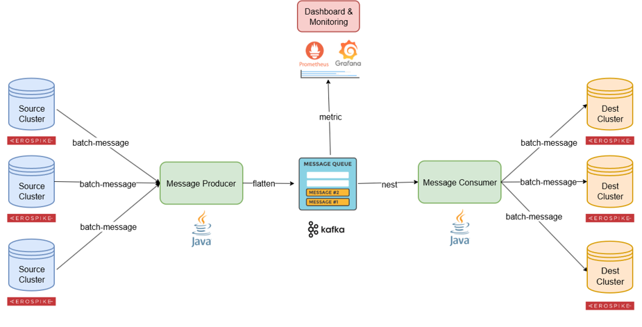
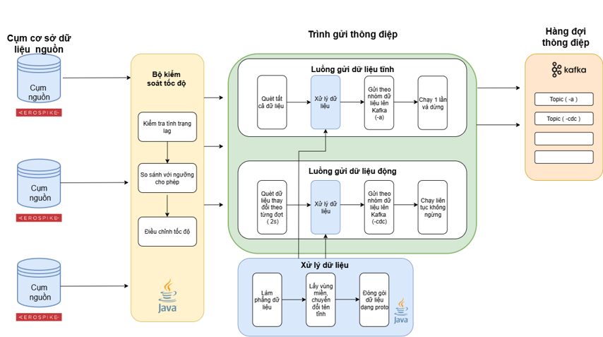
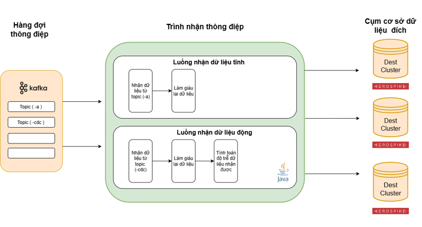
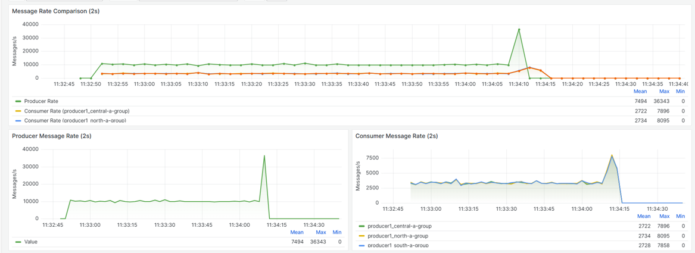
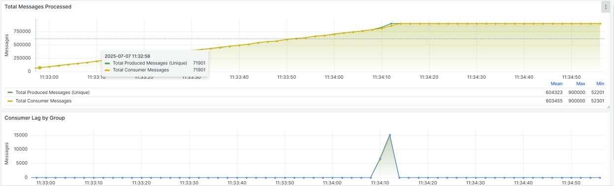

# HỆ THỐNG ĐỒNG BỘ DỮ LIỆU PHÂN TÁN 

---

## 1. Tổng quan hệ thống

<p align="center">
  
</p>

**HỆ THỐNG ĐỒNG BỘ DỮ LIỆU PHÂN TÁN** là hệ thống đồng bộ dữ liệu giữa các cụm cơ sở dữ liệu phân tán, sử dụng Aerospike (NoSQL) và Kafka (streaming platform) để đảm bảo dữ liệu luôn nhất quán, realtime, phục vụ các bài toán hợp nhất dữ liệu lớn giữa các tỉnh/thành phố, đặc biệt trong ngành viễn thông.

- **Đồng bộ dữ liệu động (CDC):** Ghi nhận và truyền tải mọi thay đổi dữ liệu (insert/update/delete) từ Aerospike nguồn sang Kafka, sau đó tới Aerospike đích.
- **Đồng bộ dữ liệu tĩnh (Full/Static):** Hỗ trợ quét và đẩy toàn bộ dữ liệu hiện có (full scan) từ Aerospike nguồn sang Kafka/Aerospike đích, đảm bảo đồng bộ ban đầu hoặc khi cần làm mới dữ liệu.
- **Giám sát realtime:** Tích hợp Prometheus & Grafana, cung cấp dashboard trực quan về TPS, độ trễ, lỗi, trạng thái pipeline.

---

## 2. Kiến trúc chi tiết & luồng dữ liệu

### a. Luồng Producer (bao gồm cả tĩnh và động)

<p align="center">
  
</p>

- **Luồng dữ liệu tĩnh (Full/Static):**
  - Quét toàn bộ dữ liệu từ các cụm Aerospike nguồn (scanAll), xử lý và gửi lên Kafka theo từng batch.
  - Dùng khi khởi tạo hệ thống hoặc cần làm mới dữ liệu toàn phần.
- **Luồng dữ liệu động (CDC):**
  - Theo dõi thay đổi (CDC) từng bản ghi, gửi lên Kafka liên tục theo thời gian thực.
  - Đảm bảo dữ liệu luôn cập nhật, không bỏ sót sự kiện.
- **Bộ kiểm soát tốc độ:**
  - Theo dõi lag, điều chỉnh tốc độ gửi để tránh quá tải hệ thống downstream.

### b. Luồng Consumer (nhận dữ liệu và ghi về đích)

<p align="center">
  
</p>

- **Luồng nhận dữ liệu tĩnh:**
  - Nhận dữ liệu từ topic `-a` (full/static), làm giàu lại dữ liệu, ghi vào Aerospike đích.
- **Luồng nhận dữ liệu động:**
  - Nhận dữ liệu từ topic `-cdc`, làm giàu lại dữ liệu, tính toán độ trễ, ghi vào Aerospike đích.
- **Đảm bảo tính đúng đắn, không trùng lặp, kiểm soát offset và retry.**

---

## 3. Dashboard & Giám sát hệ thống

### a. Dashboard tổng quan pipeline

<p align="center">
  
</p>

- Theo dõi tổng số message đã xử lý, lag của consumer, trạng thái pipeline.

### b. Dashboard chi tiết hiệu năng

<p align="center">
  
</p>

- So sánh tốc độ producer/consumer, rate từng nhóm, drill-down theo topic, consumer group.
- Phát hiện bottleneck, điều chỉnh cấu hình phù hợp.

---

## 4. Đặc điểm nổi bật

- **Realtime & Reliable:** Đảm bảo dữ liệu đồng bộ tức thời, không mất mát, không trùng lặp.
- **Scalable:** Dễ mở rộng số lượng node Aerospike/Kafka, tăng throughput bằng thread pool, batch, partition.
- **Configurable:** Cấu hình linh hoạt qua file YAML, mapping vùng, topic, consumer group.
- **Monitoring mạnh mẽ:** Prometheus & Grafana, dashboard trực quan.
- **Tối ưu hiệu năng:** Batch, rate control, retry, backpressure, sliding window latency monitor.
- **Tích hợp kiểm thử, xác minh dữ liệu:** Module test, data verifier, random insert/operation.

---

## 5. Cấu trúc thư mục

```
VHT--demo/
├── assets/                # Hình ảnh, sơ đồ minh họa
├── docker/                # Docker Compose, config Aerospike, Kafka, Prometheus, Grafana
├── my-data-pipeline/      # Source code Java: common, producer-app, consumer-app, test-runner, proto
│   ├── common/            # Thư viện dùng chung, config
│   ├── producer-app/      # CDC Producer, AProducer (full/static)
│   ├── consumer-app/      # CDC Consumer, AConsumer (full/static)
│   ├── test-runner/       # Tool kiểm thử, random insert, data verifier
│   └── proto/             # Định nghĩa protobuf
└── README.md              # Tài liệu này
```

---

## 6. Hướng dẫn triển khai nhanh

### a. Khởi tạo dịch vụ nền tảng

```sh
cd docker
# Khởi động Aerospike, Kafka, Prometheus, Grafana
sudo docker-compose up -d
```

### b. Build & chạy pipeline đồng bộ

```sh
cd my-data-pipeline
# Build toàn bộ project
mvn clean install -DskipTests

# Chạy đồng bộ dữ liệu tĩnh (full/static)
java -cp test-runner/target/test-runner-1.0-SNAPSHOT.jar com.example.pipeline.full.MainAll

# Chạy đồng bộ dữ liệu động (CDC)
java -cp test-runner/target/test-runner-1.0-SNAPSHOT.jar com.example.pipeline.cdc.Maincdc
```

### c. Truy cập dashboard giám sát

- Prometheus: http://localhost:9090
- Grafana: http://localhost:3000 (user/pass mặc định: admin/admin)
- Import dashboard mẫu từ `docker/etc/grafana/dashboards/`

---

## 7. Tham số cấu hình quan trọng

- `config.yaml`, `config-docker.yaml`: Định nghĩa mapping vùng, topic, rate limit, worker pool, retry...
- `docker-compose.yml`: Khởi tạo các service nền tảng.
- `proto/profile.proto`: Định nghĩa schema dữ liệu truyền tải.

---

## 8. Đóng góp & liên hệ

- Mọi ý kiến đóng góp, báo lỗi xin gửi issue trên GitHub hoặc liên hệ trực tiếp.
- **Chủ nhiệm đề tài:** thanhnm3

---

**Lưu ý:**
- Repo này phục vụ mục đích demo, không khuyến cáo dùng trực tiếp cho production.
- Hãy điều chỉnh thông số, cấu hình cho phù hợp môi trường thực tế.